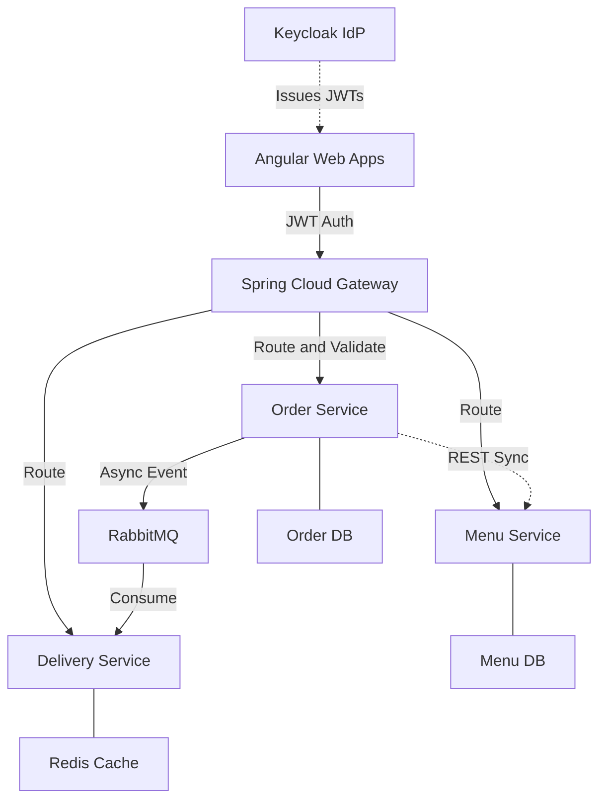

# 🍔 Logiroute: Enterprise Microservices Platform


**Logiroute** is a full-stack, distributed food delivery and logistics platform designed to demonstrate modern, enterprise-grade software architecture. It handles the complex workflows of multi-tenant restaurant catalog management, distributed order orchestration, and real-time courier logistics.

---

## 🎯 Project Overview

This project was built from the ground up to showcase the ability to architect, develop, and deploy a complex system of independently scalable microservices. It emphasizes clean code, strict domain boundaries, secure authentication, and robust asynchronous communication.

### Core Business Capabilities
- **Multi-tenant Restaurant Management:** Dynamic menus, categories, and complex customizable item options.
- **Distributed Order Orchestration:** A strict state machine governing the lifecycle of a food order from placement to delivery.
- **Logistics & Routing:** Courier dispatching and real-time delivery status tracking.
- **Unified Web Portals:** Role-based dashboards for Customers, Restaurant Owners, and System Admins.

---

## 🏗 High-Level Architecture

Logiroute relies on an API Gateway pattern to route traffic, an Identity Provider for zero-trust security, and a message broker for event-driven, asynchronous service communication.



---

## 🛠 The Technology Stack

Logiroute leverages industry-standard tools and frameworks across the entire stack:

### Backend & API
- **Java 21 & Spring Boot 4.1.0:** The core framework powering all backend microservices.
- **Spring Cloud Gateway:** Centralized routing, cross-origin resource sharing (CORS), and rate limiting.
- **MapStruct & Jackson 3:** High-performance DTO-to-Entity mapping and JSON serialization.
- **Jakarta Validation:** Strict payload validation at the controller boundaries.

### Security & Identity
- **Keycloak:** Self-hosted open-source Identity and Access Management (IAM).
- **Spring Security (OAuth2 / OIDC):** Configured as Resource Servers to cryptographically validate Stateless JWTs.

### Data & Messaging
- **PostgreSQL 16:** The primary relational database, segmented per microservice to enforce bounded contexts.
- **Flyway:** Automated, version-controlled database schema migrations.
- **RabbitMQ:** Message broker for resilient, asynchronous event-driven communication (e.g., dispatching couriers).
- **Redis:** High-speed in-memory caching.

### Testing & Infrastructure
- **Testcontainers:** Spinning up ephemeral Docker containers (Postgres, RabbitMQ, Keycloak) during the build phase for true Integration Testing.
- **JUnit 5 & Mockito:** Comprehensive unit testing of business logic.
- **Docker Compose:** Local development orchestration.

---

## 🧩 The Microservices Breakdown

Logiroute is structured as a monorepo. Each service maintains its own isolated database and domain logic.

| Service | Role / Description |
| :--- | :--- |
| **`gateway-service`** | The singular entry point. Validates JWTs, handles CORS, and routes traffic. |
| **`menu-service`** | Manages restaurant profiles, hierarchical menu categories, and item customizations. |
| **`order-service`** | The central orchestrator. Maintains the strict state machine of an order (`PENDING` ➔ `PREPARING` ➔ `OUT_FOR_DELIVERY`). |
| **`delivery-service`** | The logistics engine. Listens to RabbitMQ events to match available couriers to ready orders. |
| **`angular-frontend`**| The client interface utilizing Role-Based Access Control (RBAC) to display the correct dashboard. |

---

## 🌿 Engineering Practices

- **Strict Branching Strategy:** Monorepo branches follow a standardized format: `[service-name]/[type]/[description]` (e.g., `order-service/feat/state-machine`).
- **Database Isolation:** Microservices do not share database tables. Cross-boundary data requests happen strictly over REST or RabbitMQ.
- **DTO Encapsulation:** Internal JPA entities are never leaked to the client. MapStruct strictly controls the boundaries.
- **Global Exception Handling:** `@ControllerAdvice` standardizes all HTTP error responses globally across services.

---

## 🚀 Getting Started (Local Development)

### Prerequisites
- JDK 21+
- Docker & Docker Compose
- Maven

### 1. Start the Infrastructure
Spin up PostgreSQL, Keycloak, RabbitMQ, and Redis:
```bash
cd infra/docker-compose
docker-compose up -d
```

### 2. Run a Microservice
Navigate to any service and boot it up using the Maven wrapper:
```bash
cd apps/menu-service
./mvnw spring-boot:run
```